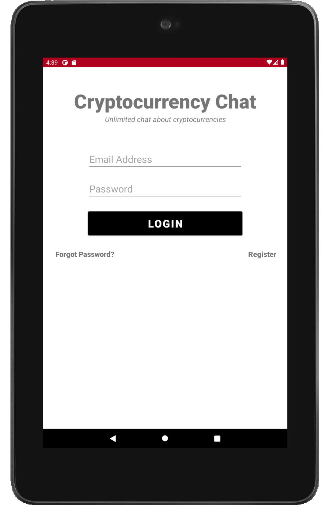
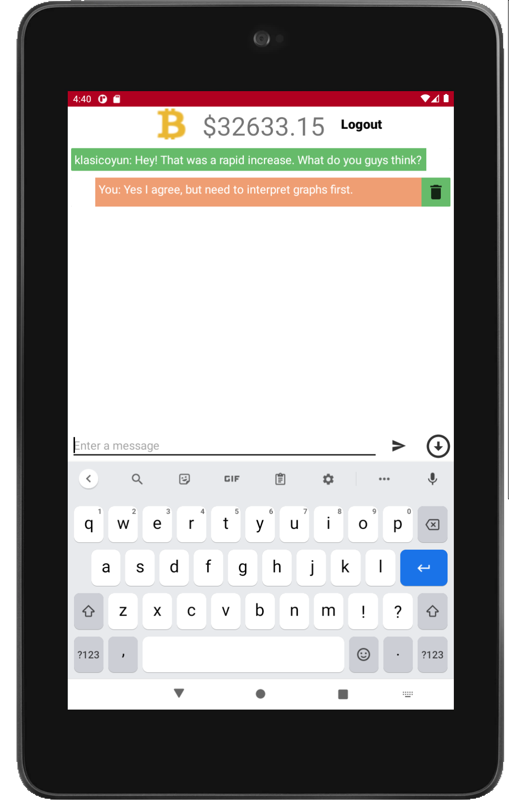
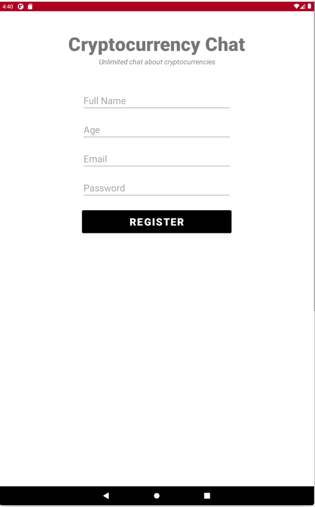
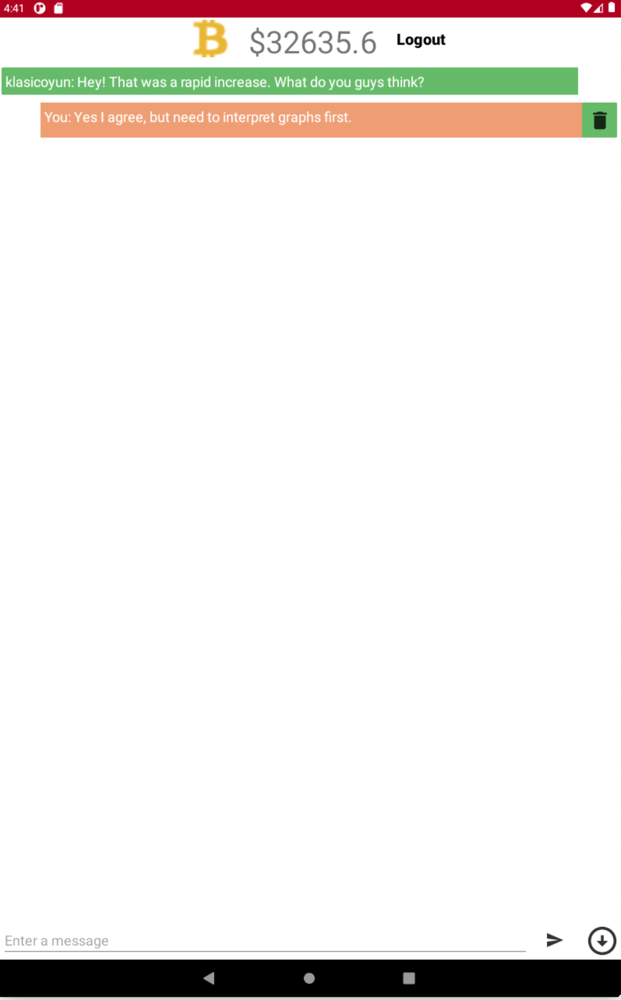

# Cryptocurrency Chat

## Installation

First clone the repository

    git clone https://github.com/kaanberke/cryptocurrencychat.git

Then create an android project on firebase with package name: ```com.project.cryptocurrencychat``` and downlaod ```google-services.json``` file. The file should be moved into app folder directly. So far so good? Nothing more, you are good to go.

## Screenshots
<div class=".Screenshots" style="text-align: center;"> 
    <p>Login Screen of 7" Tablet</p>
    
        <hr style="margin: auto;" width="300"><br>
    <p>Main Screen of 7" Tablet</p>
    
        <hr style="margin: auto;" width="300"><br>
    <p>Register Screen of 9" Tablet</p> 
    
        <hr style="margin: auto;" width="300"><br>
    <p>Main Screen of 9" Tablet</p>
    
</div>